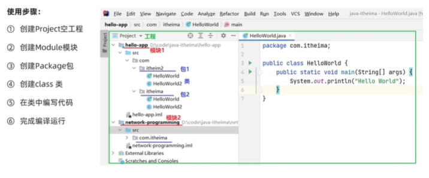
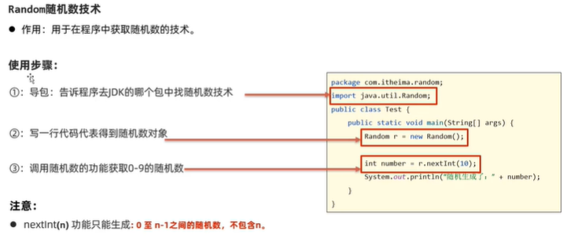
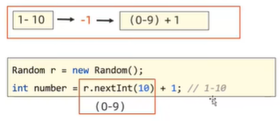
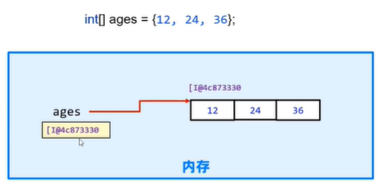
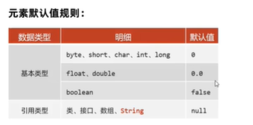
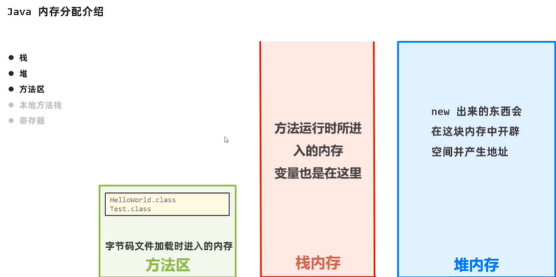

# **JavaEE课程学习笔记**

**by Shengkang Gu**           

**参考自黑马程序员教程**

https://www.bilibili.com/video/BV1Cv411372m?spm_id_from=333.999.0.0&vd_source=8cda993c1fd03f7ed2893d7f77970f42

## 第一周学习笔记

#### Java的技术平台

JavaSE（标准版）、JavaEE（企业版）、JavaME（小型版） 

#### IDEA使用步骤



#### 程序流程控制

分支结构、顺序结构、循环结构

#### Random类



1、导包

2、创建随机数对象

3、调用随机数对象的各个方法

**Random生成任意区间随机数的方法：减加法**

先确定区间长度，再使用nextInt函数，再加上相应的偏移值。

如生成1-10之间的数：




#### 数组存储的基本原理



数组是引用类型，数组元素线性按顺序存储在内存的空间中，数组名存储的是这一串数首个数据项的地址值。

Java中的数组定义之后，长度类型就已固定。

**动态定义数组不初始化时，数组元素的默认值**



#### Java内存分配介绍



针对以下程序，内存使用的过程是：

```java
public class test {
    public static void main(String[] args) {
        int a=10;
        int[] arr=new int[]{11,22,33};
        arr[0]=44;
        arr[1]=55;
        arr[2]=66;

        System.out.println(arr[0]);
        System.out.println(arr[1]);
        System.out.println(arr[2]);
    }
}
```

1. 将类编译成com文件，加载到方法区中
2. 将main方法加载到栈内存中运行
3. 在main的栈区域中开辟区域存放变量a
4. 在main中加载区域分配引用型变量arr
5. new int的对象{11，22，33}放在堆内存中，并将首元素的地址传入arr区域
6. 修改、输出数组时按照arr地址来进行索引即可


## 第二周学习笔记

